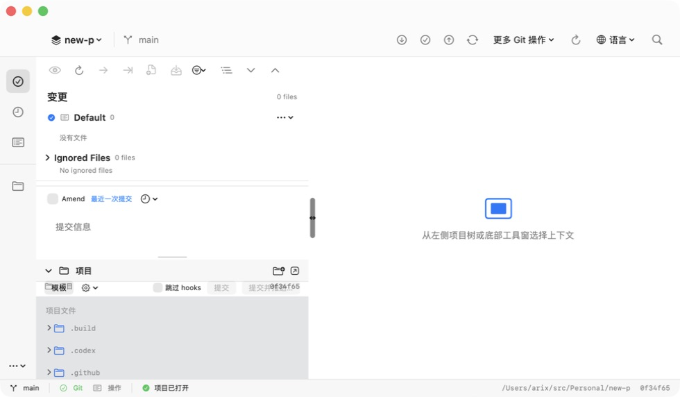

# Arbor

Arbor is a native macOS Git workbench. It combines a SwiftUI interface with a
Rust Git engine for status, staging, history graphs, branch
operations, conflict resolution, rebase, remotes, and hosting integrations.



## Download and install

Download the latest packages from the repository's
[Releases](https://github.com/arixbit/Arbor/releases/latest) page. The
automated workflow publishes an arm64 **unsigned QA** DMG and ZIP named
`Arbor-VERSION-unsigned-arm64.*`. These packages are for Apple Silicon
(arm64) and macOS 14 or later only. Intel users currently need to build a
universal archive themselves; an Intel package is not published. These are
testing packages, not Apple-trusted production releases.

1. Download `SHA256SUMS` and the DMG or ZIP from the same release.
2. Verify the checksum with `shasum -a 256 -c SHA256SUMS`.
3. Open the DMG and drag `Arbor.app` to `/Applications`, or extract the ZIP
   and move the app there.

An unsigned download has no Developer ID signature or notarization, so
Gatekeeper may block it. After verifying the checksum, first Control-click the
app in Finder and choose **Open**, or use **System Settings > Privacy &
Security > Open Anyway**. This approval is per app.

If macOS still refuses to open this verified QA package, the message may say
that the app cannot be opened or is damaged. That wording can be misleading
when Gatekeeper rejects an unsigned app, but it can also indicate a real
signature, corruption, or modification problem. Only after the checksum
matches, use this app-specific fallback:

```sh
xattr -dr com.apple.quarantine "/Applications/Arbor.app"
```

This removes the downloaded-file quarantine marker; it does not sign,
notarize, or repair the app. Do not run it when the checksum does not match,
and do not disable Gatekeeper globally. A correctly signed and notarized
production package should not require this step. See the full
[macOS installation guide](docs/macos-installation.md) for the QA flow.

## Quick start

1. Launch Arbor.
2. Choose **File > Open Project...** and select an existing Git repository.
   You can also use **Initialize Git Repository...** for a new repository or
   **Clone Git Repository...** to clone one from a remote.
3. Review local changes in the Changes workbench, stage files or hunks, and
   commit when ready.
4. Use **Branches...** for checkout, merge, rebase, pull, push, and branch
   management. Use **VCS > Git > Tool Windows > Show Log** to inspect history
   and **VCS > Git > Resolve Conflicts** when a Git operation needs manual
   resolution.

Arbor is open source under the MIT license. See [CONTRIBUTING.md](CONTRIBUTING.md)
for the repository source-of-truth and generated-file rules.

## Build and test

Requirements: macOS 14+, Xcode command-line tools, Rust stable, `cargo`, and
`xcodegen` (`brew install xcodegen`).

The checked-in source of truth is `Arbor/project.yml`. The build scripts
generate the Xcode project and the matching UniFFI Swift bindings in ignored
generated directories, so a clean clone remains reproducible without
committing machine-generated files.

```sh
cargo test --manifest-path arbor-engine/Cargo.toml
cargo build --manifest-path arbor-engine/Cargo.toml --release
./scripts/generate-swift-bindings.sh
./scripts/generate-xcode-project.sh
xcodebuild -project Arbor/Arbor.xcodeproj -scheme Arbor \
  -destination 'platform=macOS' test
```

To run the app locally, open `Arbor/Arbor.xcodeproj` in Xcode first. In the
`Arbor` target's `Signing & Capabilities`, enable automatic signing and choose
your Apple Development Team. Then run the project with `My Mac` selected, or
use the repository's repeatable launcher:

```sh
./script/build_and_run.sh --verify --project /path/to/a/git-repository
```

The launcher signs the Debug app before opening it. If you configured the Team
in Xcode, it preserves that setting when regenerating the project. You can also
pass it explicitly with `ARBOR_DEVELOPMENT_TEAM=<10-character-team-id>`.

For a local artifact, use `ARBOR_UNSIGNED=1 ./scripts/release.sh 1.0.17`. The
default output is explicitly unsigned and arm64; signing and notarization
require the external Apple Developer credentials described in
[RELEASE.md](RELEASE.md).

## Diagnostics and privacy

Arbor writes a small, structured rolling diagnostic log under
`~/Library/Logs/Arbor/`. It records operation names, repository basenames,
versions, and error codes—not access tokens, credential-bearing remote URLs,
commit messages, or file contents. Logs are exported only after the user
chooses a destination.

The release target is MIT-licensed. Third-party dependency license status is
tracked separately in [DEPENDENCY_LICENSES.md](DEPENDENCY_LICENSES.md) and
must be reviewed before a public release.
